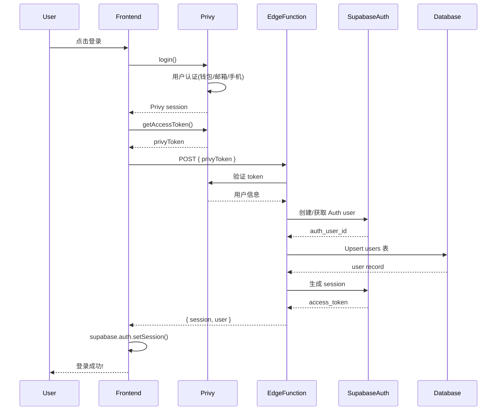

# Privy + Supabase 认证实现指南

## 概述

本项目提供了 **3 种** Privy + Supabase 认证实现方案,满足不同需求。

## 方案对比

| 方案 | 文件 | Token 类型 | 复杂度 | 推荐度 |
|------|------|-----------|--------|--------|
| A. 原始方案 | `auth-privy/index.ts` | Access Token | ⭐⭐⭐ | ✅ 生产环境推荐 |
| B. ID Token 方案 | `auth-privy-idtoken/index.ts` | Identity Token | ⭐⭐ | ⚠️ 需要配置 verification key |
| C. 简化方案 | `auth-privy-simple/index.ts` | Identity Token | ⭐ | ⚡ 最简洁 |

---

## 方案 A: 原始方案 (推荐)

### 特点
- ✅ 使用 Privy Access Token
- ✅ 通过 Privy API 验证 token
- ✅ 不需要额外配置 verification key
- ✅ 已在生产环境验证

### 前端调用

```typescript
import { usePrivy } from '@privy-io/react-auth';

const { getAccessToken } = usePrivy();

const authenticateWithSupabase = async () => {
  const privyToken = await getAccessToken();

  const response = await fetch('https://your-project.supabase.co/functions/v1/auth-privy', {
    method: 'POST',
    headers: {
      'Content-Type': 'application/json',
    },
    body: JSON.stringify({ privyToken }),
  });

  const { session, user } = await response.json();

  // 使用 session 初始化 Supabase client
  await supabase.auth.setSession({
    access_token: session.access_token,
    refresh_token: session.refresh_token,
  });
};
```

### 环境变量

```env
SUPABASE_URL=https://your-project.supabase.co
SUPABASE_SERVICE_ROLE_KEY=your-service-role-key
PRIVY_APP_ID=your-privy-app-id
```

---

## 方案 B: ID Token 方案

### 特点
- ✅ 使用 Privy Identity Token (ES256 signed JWT)
- ✅ 本地验证,更快速
- ⚠️ 需要配置 Privy verification key
- ⚠️ 需要在 Privy Dashboard 启用 ID Token

### Privy Dashboard 配置

1. 进入 Privy Dashboard → Settings → Basics
2. 启用 "Return user data in an identity token"
3. 复制 "Verification key"

### 前端调用

```typescript
import { usePrivy } from '@privy-io/react-auth';

const { getAccessToken } = usePrivy();

const authenticateWithSupabase = async () => {
  // 获取 Identity Token (需要先在 Dashboard 启用)
  const idToken = await getAccessToken(); // Privy 会返回 ID token 如果启用了

  const response = await fetch('https://your-project.supabase.co/functions/v1/auth-privy-idtoken', {
    method: 'POST',
    headers: { 'Content-Type': 'application/json' },
    body: JSON.stringify({ idToken }),
  });

  const { session } = await response.json();
  await supabase.auth.setSession(session);
};
```

### 环境变量

```env
SUPABASE_URL=https://your-project.supabase.co
SUPABASE_SERVICE_ROLE_KEY=your-service-role-key
PRIVY_APP_ID=your-privy-app-id
PRIVY_VERIFICATION_KEY="-----BEGIN PUBLIC KEY-----
MFkwEwYHKoZIzj0CAQYIKoZIzj0DAQcDQgAE...
-----END PUBLIC KEY-----"
```

---

## 方案 C: 简化方案 (推荐入门)

### 特点
- ✅ 最简洁的代码
- ✅ 使用 Identity Token
- ✅ 错误处理简化
- ⚡ 适合快速原型开发

### 前端调用

```typescript
const authenticateWithSupabase = async () => {
  const idToken = await getAccessToken();

  const { session } = await fetch('/functions/v1/auth-privy-simple', {
    method: 'POST',
    body: JSON.stringify({ idToken }),
  }).then(r => r.json());

  await supabase.auth.setSession(session);
};
```

### 环境变量

与方案 B 相同。

---

## 完整前端示例

### React Hook

```typescript
// hooks/usePrivyAuth.ts
import { usePrivy } from '@privy-io/react-auth';
import { useSupabaseClient } from '@supabase/auth-helpers-react';
import { useState } from 'react';

export function usePrivyAuth() {
  const { getAccessToken, user: privyUser } = usePrivy();
  const supabase = useSupabaseClient();
  const [loading, setLoading] = useState(false);
  const [error, setError] = useState<string | null>(null);

  const authenticateWithSupabase = async () => {
    setLoading(true);
    setError(null);

    try {
      const privyToken = await getAccessToken();

      const response = await fetch(
        `${process.env.NEXT_PUBLIC_SUPABASE_URL}/functions/v1/auth-privy`,
        {
          method: 'POST',
          headers: { 'Content-Type': 'application/json' },
          body: JSON.stringify({ privyToken }),
        }
      );

      if (!response.ok) {
        const error = await response.json();
        throw new Error(error.error || 'Authentication failed');
      }

      const { session, user } = await response.json();

      // 设置 Supabase session
      await supabase.auth.setSession({
        access_token: session.access_token,
        refresh_token: session.refresh_token,
      });

      return { session, user };
    } catch (err) {
      const errorMessage = err instanceof Error ? err.message : 'Unknown error';
      setError(errorMessage);
      throw err;
    } finally {
      setLoading(false);
    }
  };

  return {
    authenticateWithSupabase,
    loading,
    error,
    privyUser,
  };
}
```

### 在组件中使用

```typescript
// components/LoginButton.tsx
import { usePrivy } from '@privy-io/react-auth';
import { usePrivyAuth } from '@/hooks/usePrivyAuth';

export function LoginButton() {
  const { login, logout, ready, authenticated } = usePrivy();
  const { authenticateWithSupabase, loading, error } = usePrivyAuth();

  const handleLogin = async () => {
    try {
      // 1. Privy 登录
      await login();

      // 2. 获取 Supabase session
      await authenticateWithSupabase();

      console.log('Successfully authenticated with both Privy and Supabase!');
    } catch (err) {
      console.error('Login failed:', err);
    }
  };

  if (!ready) return <div>Loading...</div>;

  if (authenticated) {
    return (
      <button onClick={logout}>
        Logout
      </button>
    );
  }

  return (
    <div>
      <button onClick={handleLogin} disabled={loading}>
        {loading ? 'Authenticating...' : 'Login with Privy'}
      </button>
      {error && <p className="error">{error}</p>}
    </div>
  );
}
```

---

## 数据流程图



---

## 环境变量配置

### Supabase Dashboard

1. 进入 Project Settings → Edge Functions
2. 添加环境变量:

```env
PRIVY_APP_ID=your-privy-app-id
```

如果使用方案 B 或 C,还需要:

```env
PRIVY_VERIFICATION_KEY="-----BEGIN PUBLIC KEY-----
...
-----END PUBLIC KEY-----"
```

### 本地开发

创建 `supabase/.env.local`:

```env
SUPABASE_URL=http://127.0.0.1:54321
SUPABASE_ANON_KEY=your-local-anon-key
SUPABASE_SERVICE_ROLE_KEY=your-local-service-role-key
PRIVY_APP_ID=your-privy-app-id
PRIVY_VERIFICATION_KEY="..."
```

---

## 支持的登录方式

所有三种方案都支持:

- ✅ **Email** - 用户邮箱作为 Supabase email
- ✅ **手机号** - 转换为 `{number}@phone.privy.placeholder`
- ✅ **钱包地址** - 转换为 `{address}@wallet.privy.placeholder`
- ✅ **Social (Google, Twitter, etc.)** - 使用关联的 email

---

## 测试

### 部署 Edge Functions

```bash
# 部署方案 A (推荐)
supabase functions deploy auth-privy

# 或部署方案 B
supabase functions deploy auth-privy-idtoken

# 或部署方案 C
supabase functions deploy auth-privy-simple
```

### 本地测试

```bash
# 启动本地 Supabase
supabase start

# 运行 Edge Function
supabase functions serve auth-privy --env-file supabase/.env.local

# 测试请求
curl -X POST http://127.0.0.1:54321/functions/v1/auth-privy \
  -H "Content-Type: application/json" \
  -d '{"privyToken": "your-privy-access-token"}'
```

---

## 故障排查

### 1. "Invalid Privy token" 错误

**原因**: Token 已过期或 App ID 不匹配

**解决**:
- 检查 `PRIVY_APP_ID` 是否正确
- 确保 token 是最新获取的
- 使用 `getAccessToken()` 而不是缓存的 token

### 2. "Failed to create auth user" 错误

**原因**: Email 已被使用或数据库约束冲突

**解决**:
- 检查 `users` 表的唯一约束
- 查看 Supabase logs: Project → Logs → API

### 3. "PRIVY_VERIFICATION_KEY not configured"

**原因**: 使用方案 B/C 但未配置 verification key

**解决**:
- 从 Privy Dashboard 获取 verification key
- 添加到 Supabase Edge Functions 环境变量

### 4. 本地开发时 CORS 错误

**解决**:
```typescript
// 前端添加正确的 URL
const SUPABASE_URL = process.env.NEXT_PUBLIC_SUPABASE_URL || 'http://127.0.0.1:54321';
```

---

## 迁移指南

### 从 auth-privy 迁移到 auth-privy-simple

1. 在 Privy Dashboard 启用 Identity Token
2. 获取 Verification Key
3. 更新环境变量
4. 修改前端调用 (使用新的 endpoint)
5. 测试所有登录方式
6. 逐步迁移用户流量

### 数据库迁移

所有方案使用相同的数据库 schema,无需迁移数据。

---

## 最佳实践

1. **生产环境**: 使用方案 A (`auth-privy`)
   - 经过充分测试
   - 不需要额外配置
   - 稳定可靠

2. **高性能需求**: 使用方案 B/C (ID Token)
   - 本地验证,减少 API 调用
   - 更快的响应时间
   - 需要管理 verification key

3. **错误处理**:
   - 始终检查 token 过期
   - 实现自动 refresh 机制
   - 提供友好的错误提示

4. **安全性**:
   - 不要在前端暴露 `SERVICE_ROLE_KEY`
   - 使用 HTTPS
   - 验证 token 的 issuer 和 audience

---

## 参考资料

- [Privy Documentation](https://docs.privy.io)
- [Supabase Edge Functions](https://supabase.com/docs/guides/functions)
- [Auth Implementation Comparison](./AUTH_IMPLEMENTATION_COMPARISON.md)

---

## 支持

如有问题,请查看:
1. Supabase Logs: Project → Logs → Edge Functions
2. Privy Dashboard: Analytics → Events
3. 本地调试: `supabase functions serve --debug`
